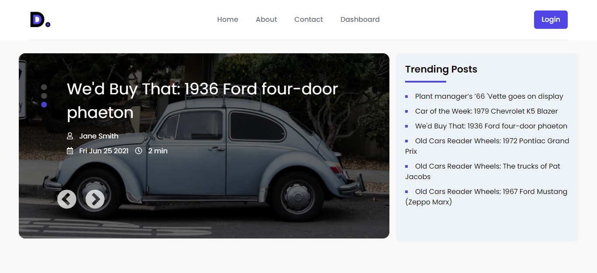

# Daily Dose Retro themed blog

Daily dose is a retro themed blog. Anyone can read blog and after click readmore button or title show the blog detail page. I have used firebase custom authentication to dashboard access. Only admin can add blog and manage blog. Admin see the all blog and delete the specific blog. Responsive design.

## Front-end Technology: 
React.js, Firebase Auth, Firebase Hosting, Tailwind CSS, Font-awesome, React-Router, React router form.

## Back-end Technology: 
Node JS, Express.js, Heroku, Mongodb.

### Live Link
[Daily Dose Blog](https://daily-dose-blog.web.app/).

### Server Side Code
[Server Side Code Link](https://github.com/shmanik14/blog-with-react-server).
